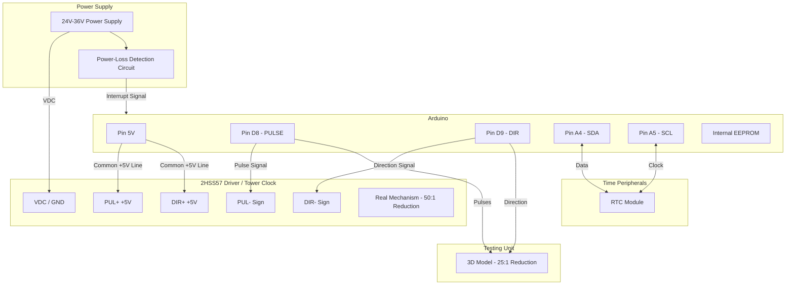

# 🕰️ Digitized Clock Tower - Modernizing a Clock Tower with Arduino

This project presents a modern solution for automating and restoring the functionality of a historic clock tower or church clock.  

The drive part of the original mechanism was replaced with a Nema 23 and a 50:1 gear reducer connected directly to the mechanism that sets the minutes and hours. The rotation of the minute hand is 1:1 with the output of the gear reducer, so 50 revolutions of the stepper motor equals one hour. The gear reducer was necessary due to the weight of the clock hands and to increase resistance to wind or frozen snow.
A real-time clock (RTC) module and an intelligent power loss management system have been added for automatic setting of the accurate time.

The project also includes support for a scaled-down 3D-printed model used for testing timekeeping algorithms in the laboratory. The 3D model has a 25:1 ratio, uses a Nema 17 stepper motor and an A498 motor driver connected to an driver expansion board set to 16 microsteps and direction commands reversed.  

Therefore there is a compile switch in the code that is used to select between the two configurations, in the future it can be used, and extended to different stepper motor driver configurations. It is currently used for testing and development in the lab.

---

## 📋 Features and Functionality

* **High Precision & Real-Time Sync:** Utilizes an RTC (Real-Time Clock) module to maintain the exact time, completely independent of the main power supply status.
* **Automatically detects power failure:** Automatically detects power failures, saves the exact state into the EEPROM before shutdown, and performs an **automatic catch-up (time recovery)** as after soon as power returns.
* **Robust Hardware Architecture:** Employs industrial-grade components (closed-loop driver, NEMA 23 motor) capable of handling extreme temperatures and high torque.

---

## 🛠️ Technical Specifications and Hardware

### Hardware Components

| Component | Model / Specification | Project Role / Connection |
| :--- | :--- | :--- |
| **Microcontroller** | Arduino Uno | Centralizes time tracking and generates sync pulses |
| **Clock Module** | RTC DS3231 | Keeps precise time. Connected to pins **A4 (SDA)** and **A5 (SCL)** |
| **Motor Driver** | **2HSS57** (or equivalent) | Industrial Hybrid Closed-Loop Driver to prevent missed steps |
| **Stepper Motor** | **NEMA 23** (or equivalent) | Drives the physical gear train of the hands in the tower |
| **Worm Gearbox 50:1** | Gear Ratio 50:1 Worm Gear Speed Reducer | NEMA 23 mounts directly on the gearbox |
| **3D Model** | 3D Printed Gear Prototype | **25:1** gear reduction (compared to **50:1** on the real clock) |

### 📌 Pinout and Code Parameters

The exact pin configuration and timing constants established for maximum accuracy:

```cpp
/* This is for testing with 3D printed clock, commented or deleted for normal clock tower */
#define PRINTED_CLOCK_3D 

#ifdef PRINTED_CLOCK_3D
  #define STEPPER_DRIVER_ENABLE_PIN       10  /* Enable/disable the stepper motor driver */
#endif

#define STEPPER_PULSE_PIN                 8   /* Arduino pin for driver motor comand */
#define STEPPER_DIR_PIN                   9   /* Arduino pin for driver motor direction */
#define STEPPER_PULSE_TIME                5   /* Time in microsec for stepper pulse */

#ifdef PRINTED_CLOCK_3D                         /* This clock has 25:1 reduction and 16 x 200 steps per revolution (16 microsteps per full step), one pulse = 1 step */
  #define NORMAL_TIME_CLOCK                44   /* Delay between pulses to set correct time clock, 45 miliseconds was calculated originally) */
  #define CLOCK_PRECISION                 968   /* Clock precision in microseconds, 984 microseconds to set correct time clock */
#else                                           /* This clock has 50:1 reduction and 200 steps per revolution, one pulse = 1/2 step */
  #define NORMAL_TIME_CLOCK               179   /* Delay between pulses to set correct time clock, 178 miliseconds (180 miliseconds was calculated originally) */
  #define CLOCK_PRECISION                 984   /* Clock precision in microseconds, 984 microseconds to set correct time clock */
#endif

#define FAST_MOVING_CLOCK                 1   /* Delay between pulses to clock faster */
#define STEPPER_FAST_TIME_ADJUSTMENT    100   /* Time in miliseconds for stepper pulse to adjust the time faster */
#ifdef PRINTED_CLOCK_3D
  #define A_QUARTER                     20000   /* Number of impuls for 15 minute */
#else
  #define A_QUARTER                      5000   /* Number of impuls for 15 minute */
#endif
#ifdef PRINTED_CLOCK_3D
#define CW_DIR                          LOW   /* Clockwise direction */
#define CCW_DIR                        HIGH   /* Counterclockwise direction */
#else
#define CW_DIR                         HIGH   /* Clockwise direction */
#define CCW_DIR                         LOW   /* Counterclockwise direction */
#endif
```

---

## 🧮 Mathematical Calculations and Fine-Tuning

For the minute hand axis to complete one full rotation in exactly **one hour (3600 seconds)**, the theoretical calculations and practical adjustments were structured as follows:

1. **Pulses per Motor Revolution:** The stepper motor configuration requires **2 pulses per step**, resulting in a total of **400 pulses** for a full 360° rotation.
2. **Clock Tower Gear Ratio:** The Worm Gear Speed Reducer has a **50:1** gear reduction. Therefore, the motor must complete 50 full revolutions for a single rotation of the clock hands:
   $$\text{Total pulses per hour} = 400 \text{ pulses/rev} \times 50 = 20,000 \text{ pulses}$$
3. **Theoretical Synchronization:** Dividing the total seconds in an hour by the required pulses yields a theoretical delay of exactly **180 milliseconds** between pulses:
   $$\frac{3600 \text{ seconds}}{20,000 \text{ pulses}} = 0.18 \text{ seconds} = 180 \text{ ms}$$
4. **Software Compensation:** In reality, the microcontroller consumes a few microseconds executing the code overhead (the `loop` cycle, reading sensors, handling conditional logic). Consequently, the theoretical 180 ms delay was reduced to `179 ms`.
5. **Empirical Fine-Tuning (`CLOCK_PRECISION`):** The ultra-precise final adjustment occurs at the microsecond level (`984 μs`). This value is dynamically adjusted (subtracted or added in code) through **direct empirical observation** of the clock's behavior over long periods: one day, a week, a month, and 6 months, ensuring zero accumulated error across seasons.

---

## 🔌 Connection Diagram (Wiring Schematic)

The block diagram below illustrates the component connections, including the I2C bus for the RTC and the control outputs to the driver/3D model using a standard **Common Anode (+5V)** configuration.



---

## 💾 Power-Loss Protection & Recovery Logic

1. **Monitoring:** To protect the Arduino and the drivers, they are connected to the power supply through a UPS. The motors are powered separately by an external source. The system continuously monitors the external source that powers the stepper motor through a voltage divider calculated at the output to give 5 volts and which is connected to the Arduino at pin 3. In the event of a voltage drop, the voltage on the stepper motor drops and 0 volts (LOW) is measured at pin 3. At that moment a timer is started for 5 seconds (can be set to different values) to protect the EEPROM from accidental writes during very short power outages. After 5 seconds, if the voltage has dropped, the date and time are read from the RTC and saved in the EEPROM and also set a flag for the voltage drop.
When the power returns, the flag is checked and, if set, the index where the power outage time is saved is read from the EEPROM, the flag is cleared The time is read from the RTC and the clock is set to real time.
2. **EEPROM Saving:** The first byte in the EEPROM stores the index where the hour, minute and second saved during the power outage are written.
3. **Recovery on Boot:** When power is restored:
   * The Arduino reads the actual, correct time from the **RTC** (which kept running on its independent backup battery).
   * The program checks if the reset is from a power failure (flag is set) indicating that the time was not recovered.
   * Check if the pin 3 indicates the occurrence of a power up (it changes its state from LOW to HIGH).
   * It compares this real time with the timestamp saved in the **EEPROM**.
   * It calculates the exact elapsed time (the minutes lost during the blackout) and generates a rapid burst of pulses (accelerated auto-catchup) until the clock hands catch up with the current time.

---

## 💻 Development Environment and Installation

The source code for this project is natively structured for modern IoT development.

### Option 1: VS Code + PlatformIO (Recommended)
This is the native environment used to develop the project:
1. Open **VS Code** and install the **PlatformIO IDE** extension.
2. Clone this repository and open the root folder inside PlatformIO.
3. The main configuration settings are in `platformio.ini`, and the logic resides in `src/main.c` (or `main.cpp`).
4. Connect your Arduino board and click the **PlatformIO: Upload** button (the arrow icon in the bottom status bar).

### Option 2: Arduino IDE (Alternative)
If you prefer using the classic Arduino IDE environment, follow these steps:
1. Open **Arduino IDE**.
2. Create a new sketch (**File -> New Sketch**).
3. Open the `src/main.c` file from this repository using any text editor, copy its entire contents, and paste them into the new sketch window in the Arduino IDE.
4. Save your project, manually install any required libraries via the Library Manager (e.g., `RTClib`), and click the **Upload** button.

---

## 📐 Interesting Note: 3D Model vs. Real Clock Tower

Because the 3D model is connected to the exact same control pins (`8` and `9`) but utilizes a different gear reduction ratio (**25:1** instead of the **50:1** ratio in the tower), a different driver, and a different stepper motor, it will physically operate differently.  
This behavior is completely intentional and ideal for prototyping phases or for different clocks with different drivers. It also allows for faster observation of kinematic patterns and helps in testing the validation of the EEPROM recovery algorithm, the power failure recognition mechanism in the implementation phase before being mounted on the tower clock.
