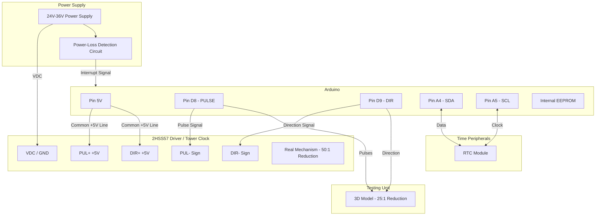

# 🕰️ Digitized Clock Tower - Modernizing a Church Clock with Arduino

This project presents a modern solution for automating and restoring the functionality of a historic clock tower or church clock. The legacy mechanical mechanism has been replaced with a digitally controlled stepper motor, assisted by a Real-Time Clock (RTC) module and an intelligent power-loss management system.

The project also includes support for a scaled-down 3D-printed model used for testing timekeeping algorithms in the laboratory.

---

## 📋 Features and Functionality

* **High Precision & Real-Time Sync:** Utilizes an RTC (Real-Time Clock) module to maintain the exact time, completely independent of the main power supply status.
* **Non-Volatile Memory (EEPROM):** Automatically detects power failures, saves the exact state into the EEPROM before shutdown, and performs an **accelerated automatic catch-up (time recovery)** as soon as power returns.
* **Robust Hardware Architecture:** Employs industrial-grade components (closed-loop driver, NEMA 23 motor) capable of handling extreme temperatures and high torque.
* **Dual-Output (Clock Tower + 3D Model):** Supports parallel connection of a 3D-printed benchmark model with a different gear ratio for visual calibration.

---

## 🛠️ Technical Specifications and Hardware

### Hardware Components

| Component | Model / Specification | Project Role / Connection |
| :--- | :--- | :--- |
| **Microcontroller** | Arduino (Uno / Nano / Mega) | Centralizes time tracking and generates sync pulses |
| **Clock Module** | RTC (e.g., DS3231) | Keeps precise time. Connected to pins **A4 (SDA)** and **A5 (SCL)** |
| **Motor Driver** | **2HSS57** (or equivalent) | Industrial Hybrid Closed-Loop Driver to prevent missed steps |
| **Stepper Motor** | **NEMA 23** (or equivalent) | Drives the physical gear train of the hands in the tower |
| **3D Model** | 3D Printed Gear Prototype | **25:1** gear reduction (compared to **50:1** on the real clock) |

### 📌 Pinout and Code Parameters

The exact pin configuration and timing constants established for maximum accuracy:

```cpp
#define STEPPER_PULSE_PIN     8    // Command pin for motor pulses (Pulse/Step)
#define STEPPER_DIR_PIN       9    // Command pin for motor direction (Direction)

// Timing and calibration parameters:
#define STEPPER_PULSE_TIME    5    // Duration of a single pulse in microseconds
#define NORMAL_TIME_CLOCK   179    // Delay between pulses in milliseconds (adjusted from 180ms)
#define CLOCK_PRECISION     984    // Clock fine-tuning / Precision in microseconds
```

---

## 🧮 Mathematical Calculations and Fine-Tuning

For the minute hand axis to complete one full rotation in exactly **one hour (3600 seconds)**, the theoretical calculations and practical adjustments were structured as follows:

1. **Pulses per Motor Revolution:** The stepper motor configuration requires **2 pulses per step**, resulting in a total of **400 pulses** for a full 360° rotation.
2. **Clock Tower Gear Ratio:** The real-world mechanism mounted in the tower has a **50:1** gear reduction. Therefore, the motor must complete 50 full revolutions for a single rotation of the clock hands:
   $$\text{Total pulses per hour} = 400 \text{ pulses/rev} \times 50 = 20,000 \text{ pulses}$$
3. **Theoretical Synchronization:** Dividing the total seconds in an hour by the required pulses yields a theoretical delay of exactly **180 milliseconds** between pulses:
   $$\frac{3600 \text{ seconds}}{20,000 \text{ pulses}} = 0.18 \text{ seconds} = 180 \text{ ms}$$
4. **Software Compensation:** In reality, the microcontroller consumes a few microseconds executing the code overhead (the `loop` cycle, reading sensors, handling conditional logic). Consequently, the theoretical 180 ms delay was reduced to `179 ms`.
5. **Empirical Fine-Tuning (`CLOCK_PRECISION`):** The ultra-precise final adjustment occurs at the microsecond level (`984 μs`). This value is dynamically adjusted (subtracted or added in code) through **direct empirical observation** of the clock's behavior over long periods: one day, a week, a month, and 6 months, ensuring zero accumulated error across seasons.

---

## 🔌 Connection Diagram (Wiring Schematic)

The block diagram below illustrates the component connections, including the I2C bus for the RTC and the control outputs to the driver/3D model using a standard **Common Anode (+5V)** configuration.



---

## 💾 Power-Loss Protection & Recovery Logic

1. **Monitoring:** The system continuously monitors the main power line supplying the clock tower.
2. **EEPROM Saving:** At the exact microsecond a power failure is detected, the microcontroller writes the last stable step state and timestamp to the internal non-volatile EEPROM before the decoupling capacitors drain.
3. **Recovery on Boot:** When power is restored:
   * The Arduino reads the actual, correct time from the **RTC** (which kept running on its independent backup battery).
   * It compares this real time with the timestamp saved in the **EEPROM**.
   * It calculates the exact elapsed time (the minutes lost during the blackout) and generates a rapid burst of pulses (accelerated auto-catchup) until the clock hands catch up with the current time.

---

## 💻 Development Environment and Installation

The source code for this project is natively structured for modern IoT development.

### Option 1: VS Code + PlatformIO (Recommended)
This is the native environment used to develop the project:
1. Open **VS Code** and install the **PlatformIO IDE** extension.
2. Clone this repository and open the root folder inside PlatformIO.
3. The main configuration settings are in `platformio.ini`, and the logic resides in `src/main.c` (or `main.cpp`).
4. Connect your Arduino board and click the **PlatformIO: Upload** button (the arrow icon in the bottom status bar).

### Option 2: Arduino IDE (Alternative)
If you prefer using the classic Arduino IDE environment, follow these steps:
1. Open **Arduino IDE**.
2. Create a new sketch (**File -> New Sketch**).
3. Open the `src/main.c` file from this repository using any text editor, copy its entire contents, and paste them into the new sketch window in the Arduino IDE.
4. Save your project, manually install any required libraries via the Library Manager (e.g., `RTClib`), and click the **Upload** button.

---

## 📐 Interesting Note: 3D Model vs. Real Clock Tower

Because the laboratory 3D model is wired to the exact same control pins (`8` and `9`) but utilizes a different gear reduction ratio (**25:1** instead of the **50:1** ratio in the tower), it will physically run twice as fast.

This behavior is completely intentional and ideal for prototyping phases. It allows for faster observation of kinematic patterns and accelerates validation testing for the EEPROM recovery algorithm in half the time before deploying to the actual church tower.
